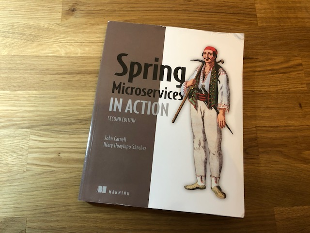

Last year, I learnt a little about microservices architecture and microservices development with the **Spring Framework**. I have decided to use this technology as it seems to be perfectly fitted for my project. I don't feel prepared enough to start programming right now so I will split my working time between taking more online courses to learn the skills I need and continuing to work on the application design, which will allow me to save time later.

### So far I have started 3 courses :

- The Containers path on the [Cloud Guru learning platform](https://acloudguru.com/learning-paths/containers). I am about to finish the Novice step.
- The [MongoDB course on Udemy](https://www.udemy.com/course/mongodb-the-complete-developers-guide/). I am learning how to structure a document.
- And Spring Microservices with the book [Spring Microservices In Action published by Manning](https://www.manning.com/books/spring-microservices-in-action-second-edition?query=spring%20microservices)

Today was dedicated to my Spring Microservices skills improvement, and here is my progression so far :

- [x] :star: 1 Welcome to the cloud, Spring
- [x] :star: 2 Exploring the microservices world with Spring Cloud
- [x] :star: 3 Building microservices with Spring Boot
- [x] :star: 4 Welcome to Docker
- [ ] 5 Controlling your configuration with the Spring Cloud Configuration Server
- [ ] 6 On service discovery
- [ ] 7 When bad things happen: Resiliency patterns with Spring Cloud and Resilience4j
- [ ] 8 Service routing with Spring Cloud Gateway
- [ ] 9 Securing your microservices
- [ ] 10 Event-driven architecture with Spring Cloud Stream
- [ ] 11 Distributed tracing with Spring Cloud Sleuth and Zipkin
- [ ] 12 Deploying your microservices
- [ ] Appendix A. Microservices architecture best practices
- [ ] Appendix B. OAuth2 grant types
- [ ] Appendix C. Monitoring your microservices

