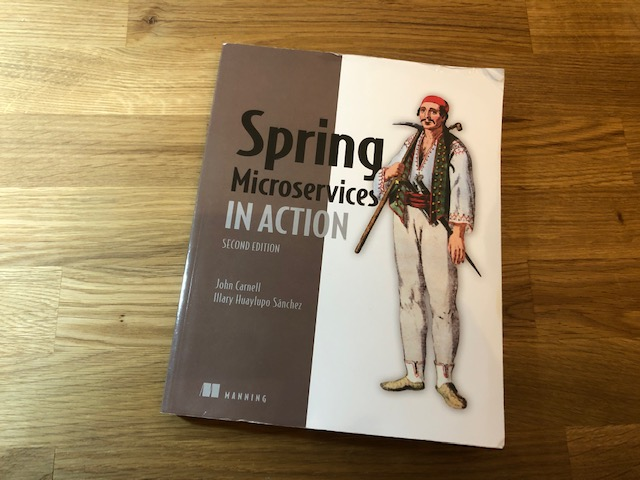
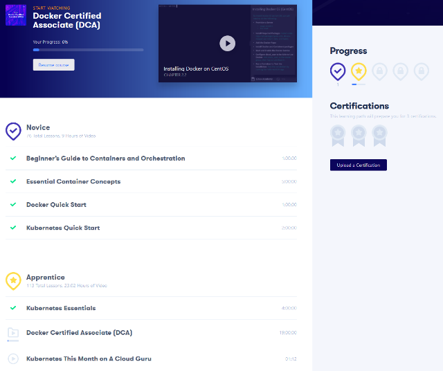
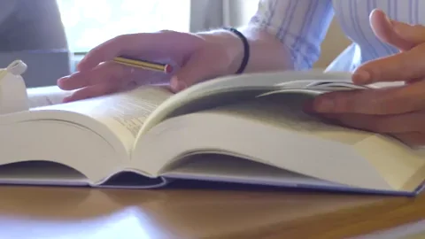

For this "no commit" work day I spent time learning more about the cloud technologies and containerization. Thoses two topics are different but closely related. The idea is to get enough skill about how it works, and especially the patterns to properly design the application.

### 📖 Microservice, Megaheadache

About the cloud techs, I am still reading my Spring Microservices in Action, coding all the examples. This book is really well explained, even if I struggled with some configuration errors during the chapter about... the configuration server!

My progression progression of the day:

- [x] ~~1 Welcome to the cloud, Spring~~
- [x] ~~2 Exploring the microservices world with Spring Cloud~~
- [x] ~~3 Building microservices with Spring Boot~~
- [x] ~~4 Welcome to Docker~~
- [x] ⭐**5 Controlling your configuration with the Spring Cloud Configuration Server**
- [ ] 6 On service discovery
- [ ] 7 When bad things happen: Resiliency patterns with Spring Cloud and Resilience4j
- [ ] 8 Service routing with Spring Cloud Gateway
- [ ] 9 Securing your microservices
- [ ] 10 Event-driven architecture with Spring Cloud Stream
- [ ] 11 Distributed tracing with Spring Cloud Sleuth and Zipkin
- [ ] 12 Deploying your microservices
- [ ] Appendix A. Microservices architecture best practices
- [ ] Appendix B. OAuth2 grant types
- [ ] Appendix C. Monitoring your microservices

---

### ☁️ Last but not least : A Cloud Guru Container Path Update

Thanks to my job I have access to the learning platform [A Cloud Guru](https://acloudguru.com/). Two weeks ago, I started the [Container Path](https://acloudguru.com/learning-paths/containers) which contains a bunch of training related to Docker and Kubernetes. Today, I have completed the Kubernetes Essentials training. It was most like Kubernetes Quick Start but with more practice Hands-on labs.

My progress (each entry is a full course, not just a book chapter):

**Novive**

- [x] ~~Beginner's Guide to Containers and Orchestration~~
- [x] ~~Essential Container Concepts~~
- [x] ~~Docker Quick Start~~
- [x] ~~Kubernetes Quick Start~~

**Apprentice**

- [x] ⭐ **Kubernetes Essentials**
- [ ] Docker Certified Associate (DCA)
- [ ] Kubernetes This Month on A Cloud Guru\*

**Pratitioner**

- [ ] Docker - Deep Dive
- [ ] Certified Kubernetes Administrator
- [ ] Learn Docker by Doing
- [ ] Certified Kubernetes Application Developer (CKAD)
- [ ] Google Kubernetes Engine Deep Dive

**Professional**

- [ ] Advanced Networking with Kubernetes on AWS
- [ ] Google Kubernetes Engine Deep Dive
- [ ] Monitoring With Prometeus

**Guru**

- [ ] Kubernetes the Hard Way

---

I still have a lot of work to do... :cold_sweat:

