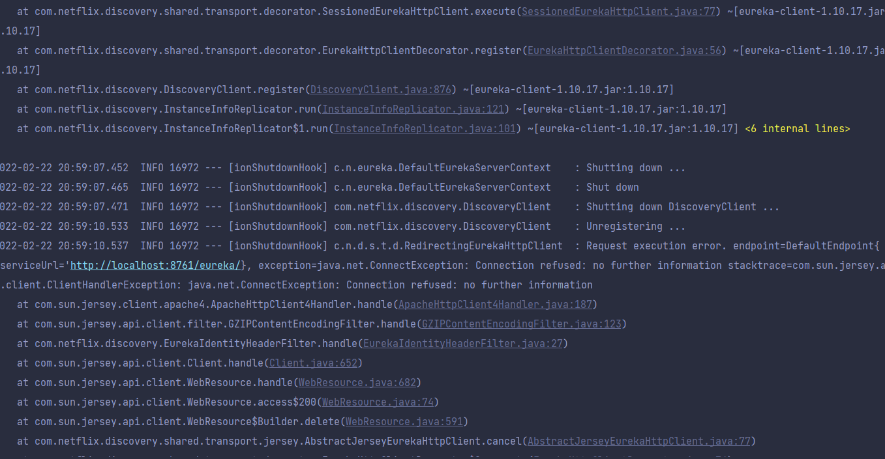

Today, my goal was to read and code two or three more chapters of Spring Microservices in Action. I hoped that I would learn enough to start coding soon. It was promising and the topic was very interesting : discovery service and load balancer. The theoritical part was great and I learnt a lot. But then I started the part about implementing those technologies in the demo project and there I entered a configuration hell... 🔥

7 hours of work later, nothing was working. I quit. ➡️🚪

